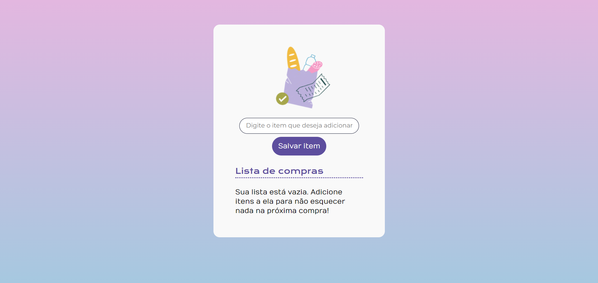
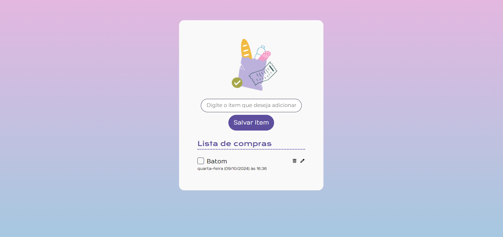
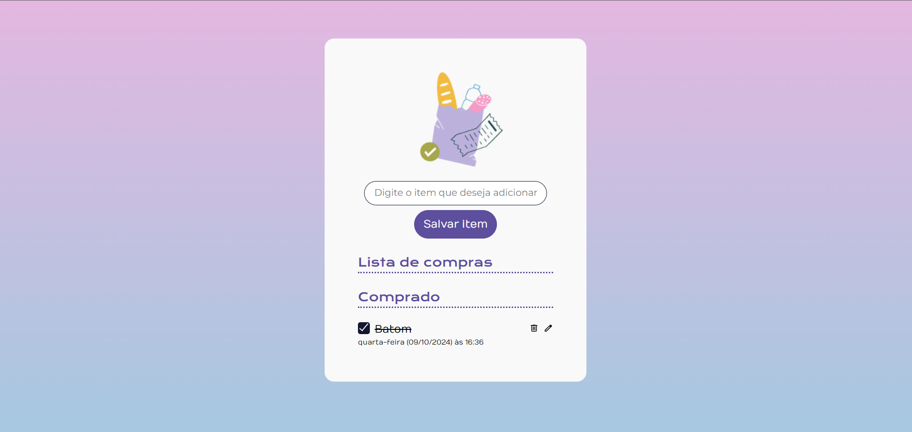
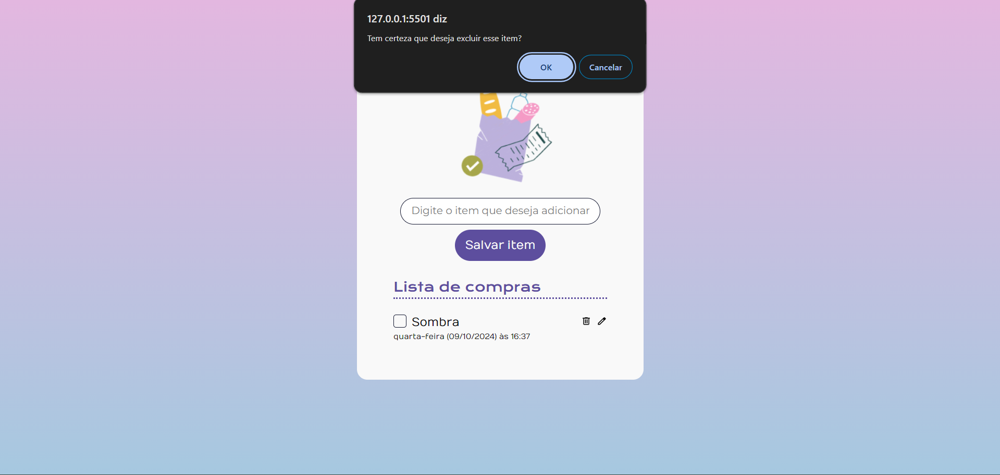
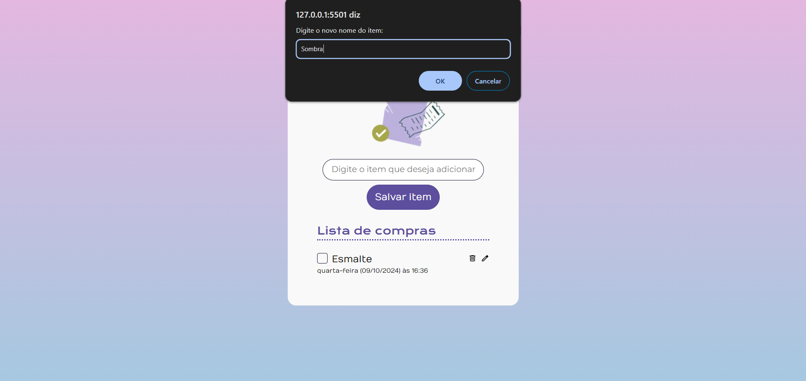

# Lista de compras
## 🔨 Funcionalidades do projeto

A aplicação permite inserir itens em uma lista de forma dinâmica, permitindo a exclusão e edição dos mesmos. Os itens terão o nome e também a data e horário que foram criados. Também é possível selecionar um checkbox para informar que o item foi comprado.

## ✔️ Técnicas e tecnologias utilizadas

- `HTML`: criação dos elementos da tela;
- `CSS`: estilização da aplicação;
- `JavaScript`: construção de elementos dinâmicos através da manipulação do DOM.

## 📁 Acesso ao projeto

git clone https://github.com/AndressaTurchetto/cry-your-shopping-list.git

